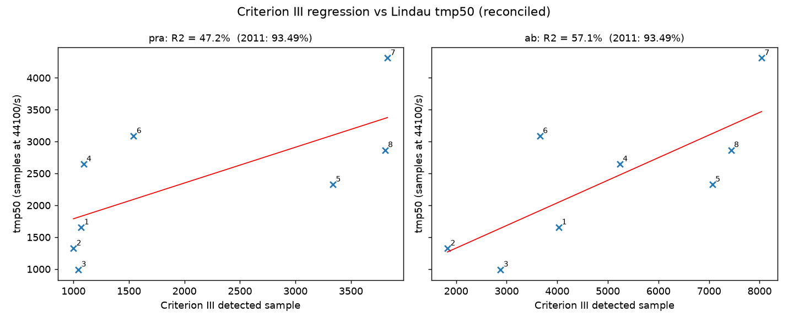
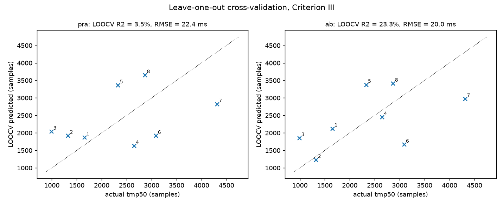
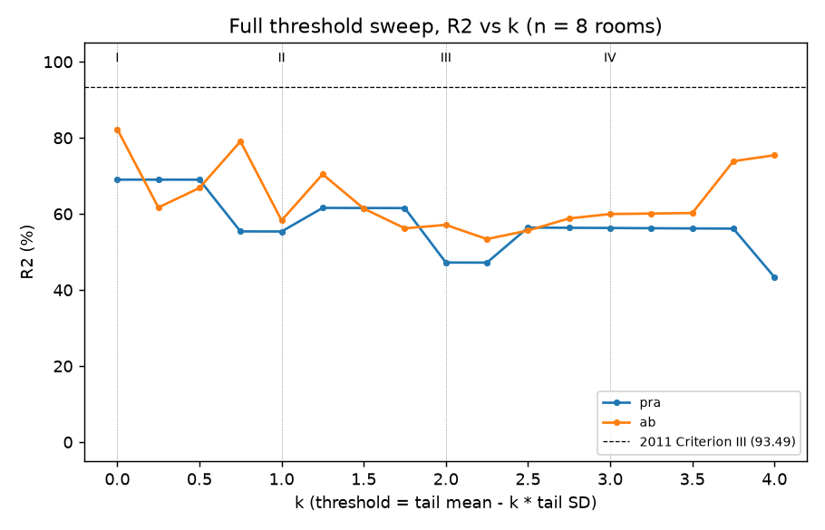
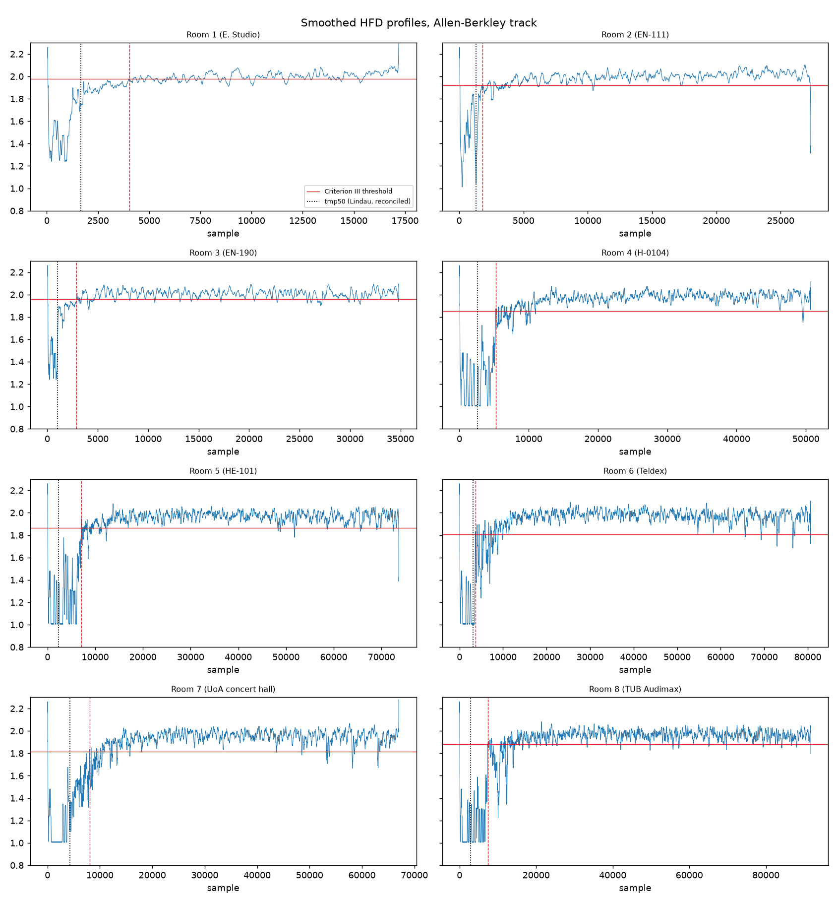

# Does the 2011 fractal-dimension mixing-time result survive re-validation?

Re-validation of Conaty (2011, MPhil thesis, TCD): predicting the perceptual
mixing time tmp50 of the Lindau et al. (2010) rooms from the first crossing
of a moving-window Higuchi fractal dimension (HFD) profile of an
image-source-model RIR. The thesis reported R squared = 93.49 percent for
its Criterion III. Pre-registered plan: `analysis/PREREGISTRATION.md`
(committed before any result existed, one amendment logged before any
regression). Full numbers: `results/analysis.json`, `results/summary.md`.

## Verdict

**The 93.49 percent correlation does not reproduce, and what does reproduce
does not survive honest validation.** Specifically:

1. **The 2011 arithmetic reproduces exactly.** Feeding the thesis's own
   detected sample numbers (its Table 6.1b) to a regression against our
   recovered ground truth gives R squared = 93.49 percent and slope 0.3197
   for Criterion III, identical to the published values (recomputed inside
   analysis/analyze.py, table at the top of results/summary.md; the raw
   digitized vector gives 93.52 percent). Criteria I and II also land
   exactly on the published 72.29 and 78.82 percent. The 2011 analysis was
   internally correct, and our recovered ground truth is essentially exact.
2. **The 2011 detector behavior broadly reproduces** on a faithful
   re-implementation of its Allen-Berkley ISM: our detected samples
   correlate r = 0.84 with the thesis's for Criterion III (0.86 for
   Criterion I), with the same ordering of small versus large rooms.
3. **The headline correlation does not reproduce.** Re-generating the RIRs
   per the documented method and re-running the identical detector yields
   Criterion III R squared = 57.1 percent (faithful Allen-Berkley track)
   and 47.2 percent (pre-registered pyroomacoustics track), versus 93.49
   claimed. The pipelines are deterministic, so this is not noise in the
   statistical sense: the roughly 40-point shortfall comes from the parts
   of the 2011 setup that are not recoverable from the thesis and had to
   be reconstructed (exact room dimensions, RIR length) plus ISM
   implementation detail. That is the point: a result that only holds for
   one unrecorded realization of its inputs is not a reproducible result.
4. **It fails honest validation outright.** LOOCV R squared is 23.3 percent
   (AB track) and 3.5 percent (pyroomacoustics track); LOOCV RMSE is about
   20 ms on a ground-truth range of 22 to 98 ms. Bootstrap 95 percent CIs
   on R squared span [6, 91] percent (AB) and [4, 89] percent (pra). With
   n = 8 the data cannot distinguish a strong predictor from a mediocre one.
5. **The choice of Criterion III was in-sample selection, and it does not
   replicate.** In our rerun the best criterion is not III but I (k = 0):
   82.3 percent on the AB track. The 2011 winner moved to the middle of the
   pack (57 percent), which is exactly the signature of picking the best of
   four correlated noisy variants and quoting its in-sample fit.

A fair summary: the underlying signal is real but modest. HFD-profile
crossing times do track room size, and hence tmp50, at roughly the level of
much simpler predictors (Lindau's own V/S regression achieved 81.5 percent).
The specific claim, Criterion III with R squared 93.49 percent and an
accuracy "greater than previous methods", is an artifact of small n,
in-sample criterion selection, and one particular ISM realization.

## Primary pre-registered result (Criterion III, k = 2)

| | pyroomacoustics (pre-registered primary) | Allen-Berkley faithful port | 2011 |
|---|---|---|---|
| R squared | 47.2 % | 57.1 % | 93.49 % |
| slope | 0.561 | 0.355 | 0.3197 |
| intercept (samples) | 1228 | 620 | 325 |
| LOOCV R squared | 3.5 % | 23.3 % | not done |
| LOOCV RMSE | 22.4 ms | 20.0 ms | not done |
| bootstrap 95 % CI on R squared | [4.3, 88.9] % | [6.0, 91.3] % | not done |
| bootstrap 95 % CI on slope | [0.11, 1.11] | [0.08, 0.57] | not done |

Both tracks were fixed before any regression was run (see Amendment 1).
Using the raw digitized ground truth instead of the reconciled values
changes R squared by less than 0.1 point, so ground-truth digitization
error plays no role in the shortfall.

## The full threshold sweep (nothing hidden)

R squared versus k in steps of 0.25 (the thesis showed only k = 0, 1, 2, 3
and quoted the best):

The curve wanders between roughly 43 and 82 percent and never approaches
93.49. The 2011 Criterion III (k = 2) sits in a local trough of our AB
curve. Best-of-sweep here would be k = 0 at 82.3 percent, a different
winner than 2011, confirming that the criterion choice is noise-driven.

Named criteria versus 2011 (AB track):

| Criterion | our R squared | 2011 R squared |
|---|---|---|
| I (k=0) | 82.3 % | 72.29 % |
| II (k=1) | 58.3 % | 78.82 % |
| III (k=2) | 57.1 % | 93.49 % |
| IV (k=3) | 60.0 % | 1.37 % (corrected) |

The 2011 Criterion IV value is the corrected one: the thesis prints 0.14
percent, which is not reproducible from its own data. This and every other
place where we override the printed thesis (a slope typo, an intercept
typo, one internally inconsistent table row, a text/table mismatch, the
abstract's range claim) are itemized with evidence in
`inputs/CORRECTIONS.md`; printed originals are always preserved there.

## Sensitivity to the arbitrary constants

Criterion III R squared under one-factor changes from the primary
configuration (window 50, kmax 5, tail 10 percent, start 1000, length
RT times fs):

| varied | value | pra | ab |
|---|---|---|---|
| window | 25 | 69.6 % | 71.6 % |
| window | 100 | 74.7 % | 25.2 % |
| kmax | 3 | 75.5 % | 62.8 % |
| kmax | 8 | 55.3 % | 58.8 % |
| tail fraction | 0.05 | 47.3 % | 67.5 % |
| tail fraction | 0.20 | 47.4 % | 61.4 % |
| RIR length | 0.75x | 61.7 % | 55.8 % |
| RIR length | 1.25x | 47.5 % | 49.4 % |
| start | 500 | 0.0 % | 57.1 % |
| start | 2000 | 80.7 % | 57.2 % |

The primary statistic swings from 0 to 81 percent under small changes to
constants the thesis fixed without justification. That fragility is itself
a finding: the method has no stable operating point.

## Exploratory only (pre-registered as secondary, not part of any claim)

Same windowing and detection on the pyroomacoustics RIRs: sample entropy
profile R squared = 44.1 percent, Katz FD profile R squared = 9.7 percent.
Neither beats the primary; no further variants were tried.

## Why the two ISM tracks differ (a finding, not a nuisance)

The thesis's Allen-Berkley code rounds every image delay to a single
integer sample, producing a sparse spike train. pyroomacoustics renders
each image as an 81-tap sinc kernel, so the early RIR is dense. The HFD of
a 51-sample window mostly measures spiky-versus-dense texture, so on
pyroomacoustics RIRs the profile saturates almost immediately (several
rooms pin at the sample-1000 search floor, visible in
`results/figures/profiles_pra.png`). The feature is therefore not a
property of the room's acoustics so much as of the ISM's interpolation
scheme. Any practical use on measured RIRs would face the same problem:
measured responses are band-limited and dense, like the pyroomacoustics
track, which is the track with the weaker result (47.2 percent, LOOCV 3.5
percent).

## Ground truth provenance

The thesis never tabulates tmp50 per room. Values were digitized
programmatically from the native-resolution embedded images of its Figure
6.2 (four panels agree within 0.5 samples per room), cross-checked against
Figure 4.3.2, and reconciled against the four reported 2011 regressions
(ten of twelve reported statistics reproduced exactly). All eight values
sit within 3.5 samples of round-millisecond values: 37.5, 30.0, 22.5,
60.0, 52.8, 70.0, 97.8, 65.0 ms for rooms 1 to 8, which is almost
certainly the exact 2011 vector. Estimated uncertainty about 5 samples
(0.1 ms); switching between digitized and reconciled vectors moves no
result by more than 0.1 R squared point. Room 9's tmp50 and all tmp95
values are unrecoverable from the thesis and are marked missing, not
guessed. Audit overlays: `inputs/digitization_debug/`. One oddity: the
thesis abstract's "37.5 to 97.8 ms" range misstates its own data's minimum
(Room 3, about 22.5 ms).

## Caveats, all of them

- **ISM, not measured BRIRs.** Both tracks are simulations, the same
  fidelity ceiling the 2011 study had. The Lindau measured BRIR set could
  not be obtained in this environment (paper and data are paywalled or
  blocked; documented in the session log), so the planned secondary
  higher-fidelity check was not possible.
- **n = 8.** Nothing stronger than the bootstrap intervals above can
  honestly be said at this sample size, in either direction.
- **Geometry reconstruction.** Room proportions were digitized from the
  thesis's floor-plan figure (about 0.3 to 1 m per edge uncertainty),
  heights derived from tabulated volumes. Untuned Sabine RTs from these
  shapes match the tabulated RTs within 1 percent for rooms 1 to 8, so the
  reconstruction is good, but it is not the thesis's exact input, which is
  unrecoverable.
- **RIR length is an assumption.** The thesis never states it; RT times fs
  matches its Figure 5.3 for Room 1 and was adopted throughout. The
  sensitivity table shows the result depends on it (47 to 62 percent).
- **Schroeder RT60 of the generated RIRs overshoots the tabulated RT by up
  to about 1.3x for large rooms** (non-diffuse uniform-absorption shoebox
  ISM, both tracks; expected physics, recorded per room in
  `results/rooms/`).
- **Thesis-internal inconsistencies** are corrected where the evidence is
  decisive, with every override logged in `inputs/CORRECTIONS.md`
  (printed original, corrected value, evidence); the GUI versus text
  source/receiver swap is left as-is (reciprocal, no correction needed).
  None of the corrections affect the conclusions.

## Reproduce this

    pip install -r requirements.txt
    pytest                      # 22 unit tests incl. known-FD validation
    python3 analysis/run_room.py N   # N = 1..9, deterministic
    python3 analysis/analyze.py      # regressions, sweep, LOOCV, bootstrap

Bootstrap seed 20260722. Package versions pinned in `requirements.txt`.
Subagent audit trail in `analysis/LOG.md`.
